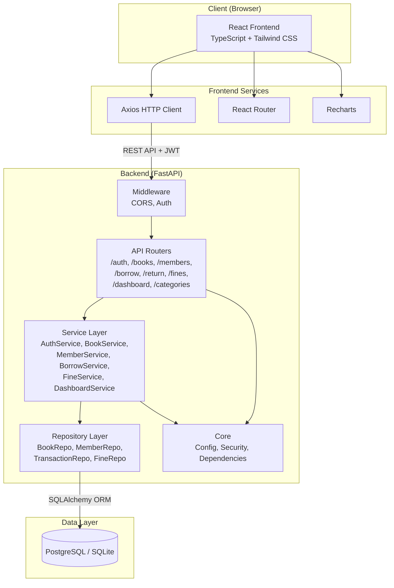
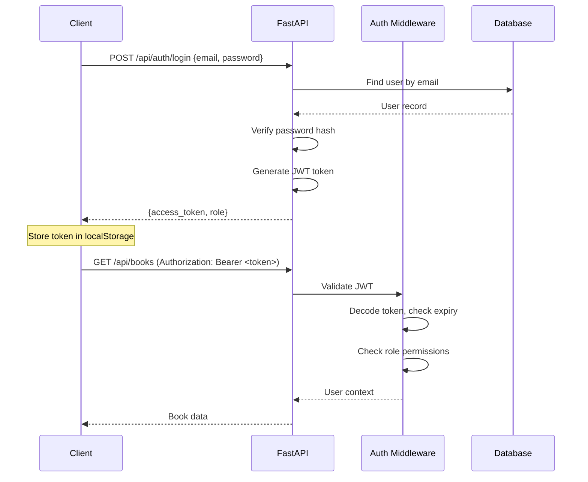
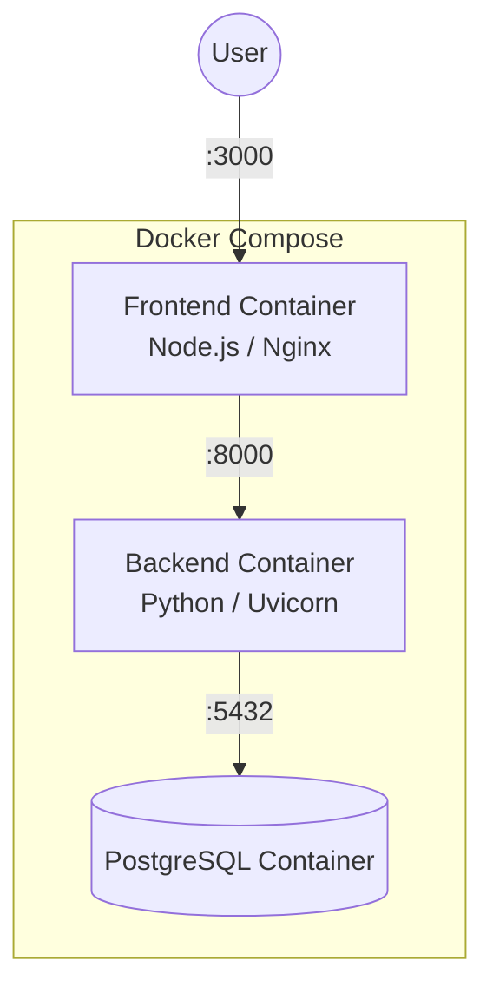

# System Architecture — Library Management System

## 1. Architecture Overview

The system follows a **three-tier layered architecture** with a clear separation between presentation, business logic, and data access.

```
┌──────────────────────────────────────────────┐
│                   CLIENT                      │
│          React + TypeScript + Vite            │
│   (Pages, Components, Services, Hooks)        │
└──────────────────┬───────────────────────────┘
                   │ HTTP / REST (JSON)
                   │ JWT Bearer Token
                   ▼
┌──────────────────────────────────────────────┐
│                 API LAYER                     │
│              FastAPI Routers                  │
│   (Route handlers, request/response parsing)  │
├──────────────────────────────────────────────┤
│              SERVICE LAYER                    │
│         Business Logic & Rules                │
│   (Validation, fine calculation, workflows)    │
├──────────────────────────────────────────────┤
│            REPOSITORY LAYER                   │
│          Data Access (SQLAlchemy)              │
│   (CRUD operations, queries, transactions)    │
├──────────────────────────────────────────────┤
│               DATABASE                        │
│       PostgreSQL / SQLite                     │
└──────────────────────────────────────────────┘
```

## 2. Architecture Diagram (Mermaid)



## 3. Layer Descriptions

### 3.1 Presentation Layer (Frontend)

**Technology:** React, TypeScript, Vite, Tailwind CSS, React Router, Axios, Recharts

**Responsibilities:**
- Render UI components and pages
- Handle user interactions
- Client-side form validation
- Route management and navigation
- JWT token storage and management
- API communication via Axios
- Role-based UI rendering (show/hide features based on role)

**Key Directories:**
| Directory | Purpose |
|-----------|---------|
| `pages/` | Page-level components for each route |
| `components/` | Reusable UI components (tables, forms, modals) |
| `layouts/` | Page layouts (Admin layout, Student layout) |
| `services/` | API service functions (Axios calls) |
| `hooks/` | Custom React hooks (useAuth, useBooks, etc.) |
| `types/` | TypeScript type definitions |
| `utils/` | Utility functions |

### 3.2 API Layer (Backend Routers)

**Technology:** FastAPI

**Responsibilities:**
- Define REST API endpoints
- Parse and validate request data (via Pydantic)
- Authentication and authorization checks
- Delegate business logic to the service layer
- Return properly formatted responses with correct HTTP status codes
- Auto-generate OpenAPI/Swagger documentation

**Key Routers:**
| Router | Prefix | Purpose |
|--------|--------|---------|
| `auth.py` | `/api/auth` | Login, token management |
| `books.py` | `/api/books` | Book CRUD, search |
| `categories.py` | `/api/categories` | Category management |
| `members.py` | `/api/members` | Member CRUD, search |
| `borrow.py` | `/api/borrow` | Issue book, view transactions |
| `returns.py` | `/api/return` | Return book |
| `fines.py` | `/api/fines` | View fines |
| `dashboard.py` | `/api/dashboard` | Statistics and summaries |

### 3.3 Service Layer

**Responsibilities:**
- Implement business rules and workflows
- Coordinate between multiple repositories when needed
- Fine calculation logic
- Eligibility checks (borrow limit, member status)
- Due date calculation
- Data transformation between schemas and models

**Key Services:**
| Service | Purpose |
|---------|---------|
| `AuthService` | Credential verification, token generation |
| `BookService` | Book business logic, availability checks |
| `MemberService` | Member business logic, eligibility checks |
| `BorrowService` | Issue workflow, return workflow |
| `FineService` | Fine calculation, fine queries |
| `DashboardService` | Statistics aggregation |

### 3.4 Repository Layer

**Responsibilities:**
- Database CRUD operations
- Complex queries (search, filter, pagination)
- Encapsulate SQLAlchemy operations
- Provide a clean data access interface to the service layer

### 3.5 Data Layer

**Technology:** PostgreSQL (production), SQLite (development), SQLAlchemy ORM

**Responsibilities:**
- Persistent data storage
- Referential integrity (foreign keys, constraints)
- Indexing for performance
- Transaction management

## 4. Cross-Cutting Concerns

### 4.1 Authentication & Authorization



- **JWT Token** contains: user_id, role, expiration
- **Protected routes** require valid JWT in Authorization header
- **Role checking** is done via FastAPI dependencies

### 4.2 Error Handling

- Backend returns structured error responses: `{ "detail": "Error message" }`
- HTTP status codes convey error type (400, 401, 403, 404, 409, 422, 500)
- Frontend Axios interceptor handles 401 (redirect to login) and displays error messages
- No internal stack traces exposed to users

### 4.3 Configuration

All configurable values are loaded from environment variables:

| Variable | Purpose | Default |
|----------|---------|---------|
| `DATABASE_URL` | Database connection string | `sqlite:///./library.db` |
| `JWT_SECRET` | Secret key for JWT signing | (required) |
| `ACCESS_TOKEN_EXPIRE_MINUTES` | Token expiration time | `60` |
| `FINE_PER_DAY` | Fine rate per overdue day (₹) | `5` |
| `MAX_BORROW_LIMIT` | Max books per member | `5` |
| `LOAN_PERIOD_DAYS` | Default loan duration | `14` |
| `CORS_ORIGINS` | Allowed frontend origins | `http://localhost:5173` |

## 5. Deployment Architecture



For development:
- Frontend: `npm run dev` (Vite dev server on port 5173)
- Backend: `uvicorn app.main:app --reload` (FastAPI on port 8000)
- Database: SQLite file (no separate process needed)

For deployment:
- Docker Compose orchestrates all three services
- Frontend served via Nginx
- Backend served via Uvicorn
- PostgreSQL as the database
