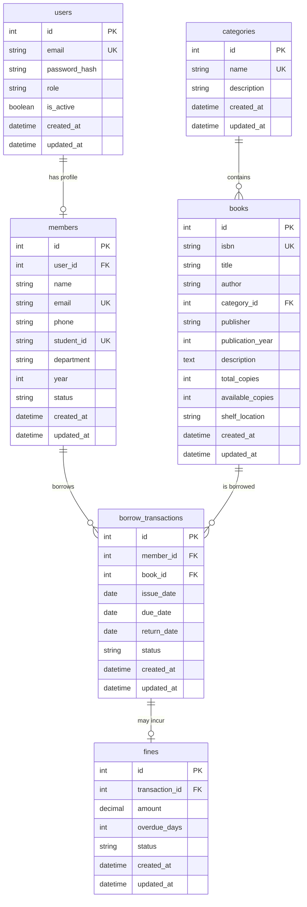

# Database Design — Library Management System

## 1. Design Principles

- **Normalized** to 3NF to avoid data redundancy
- **Referential integrity** via foreign keys
- **Timestamps** on all tables for auditing
- **Soft delete** for members (status field) rather than hard delete
- **Indexes** on searchable and frequently queried columns
- **Database-agnostic** via SQLAlchemy ORM

## 2. Entity-Relationship Diagram

## 3. Table Definitions

### 3.1 `users`

The authentication table. Each user has a role (admin or student).

| Column | Type | Constraints | Description |
|--------|------|-------------|-------------|
| `id` | INTEGER | PK, AUTO INCREMENT | Unique identifier |
| `email` | VARCHAR(255) | UNIQUE, NOT NULL | Login email |
| `password_hash` | VARCHAR(255) | NOT NULL | bcrypt hashed password |
| `role` | VARCHAR(20) | NOT NULL, CHECK(role IN ('admin', 'student')) | User role |
| `is_active` | BOOLEAN | NOT NULL, DEFAULT TRUE | Account active status |
| `created_at` | TIMESTAMP | NOT NULL, DEFAULT NOW | Record creation time |
| `updated_at` | TIMESTAMP | NOT NULL, DEFAULT NOW | Last update time |

**Indexes:** `email` (unique index)

---

### 3.2 `members`

Student/member profile information. Linked to `users` for authentication.

| Column | Type | Constraints | Description |
|--------|------|-------------|-------------|
| `id` | INTEGER | PK, AUTO INCREMENT | Unique identifier |
| `user_id` | INTEGER | FK → users(id), UNIQUE | Associated user account |
| `name` | VARCHAR(255) | NOT NULL | Full name |
| `email` | VARCHAR(255) | UNIQUE, NOT NULL | Contact email |
| `phone` | VARCHAR(20) | | Phone number |
| `student_id` | VARCHAR(50) | UNIQUE, NOT NULL | Institution student ID |
| `department` | VARCHAR(100) | | Academic department |
| `year` | INTEGER | | Current year of study |
| `status` | VARCHAR(20) | NOT NULL, DEFAULT 'active', CHECK(status IN ('active', 'inactive')) | Membership status |
| `created_at` | TIMESTAMP | NOT NULL, DEFAULT NOW | Record creation time |
| `updated_at` | TIMESTAMP | NOT NULL, DEFAULT NOW | Last update time |

**Indexes:** `user_id` (unique), `student_id` (unique), `email` (unique), `name` (for search)

---

### 3.3 `categories`

Book categories for classification.

| Column | Type | Constraints | Description |
|--------|------|-------------|-------------|
| `id` | INTEGER | PK, AUTO INCREMENT | Unique identifier |
| `name` | VARCHAR(100) | UNIQUE, NOT NULL | Category name |
| `description` | TEXT | | Category description |
| `created_at` | TIMESTAMP | NOT NULL, DEFAULT NOW | Record creation time |
| `updated_at` | TIMESTAMP | NOT NULL, DEFAULT NOW | Last update time |

**Indexes:** `name` (unique index)

---

### 3.4 `books`

The book catalog.

| Column | Type | Constraints | Description |
|--------|------|-------------|-------------|
| `id` | INTEGER | PK, AUTO INCREMENT | Unique identifier |
| `isbn` | VARCHAR(20) | UNIQUE, NOT NULL | ISBN |
| `title` | VARCHAR(500) | NOT NULL | Book title |
| `author` | VARCHAR(255) | NOT NULL | Author name(s) |
| `category_id` | INTEGER | FK → categories(id) | Book category |
| `publisher` | VARCHAR(255) | | Publisher name |
| `publication_year` | INTEGER | | Year of publication |
| `description` | TEXT | | Book description |
| `total_copies` | INTEGER | NOT NULL, CHECK(≥ 0) | Total copies owned |
| `available_copies` | INTEGER | NOT NULL, CHECK(≥ 0) | Currently available |
| `shelf_location` | VARCHAR(50) | | Physical shelf location |
| `created_at` | TIMESTAMP | NOT NULL, DEFAULT NOW | Record creation time |
| `updated_at` | TIMESTAMP | NOT NULL, DEFAULT NOW | Last update time |

**Constraints:** `available_copies <= total_copies`  
**Indexes:** `isbn` (unique), `title` (for search), `author` (for search), `category_id` (for filtering)

---

### 3.5 `borrow_transactions`

Records each book borrowing event.

| Column | Type | Constraints | Description |
|--------|------|-------------|-------------|
| `id` | INTEGER | PK, AUTO INCREMENT | Unique identifier |
| `member_id` | INTEGER | FK → members(id), NOT NULL | Borrowing member |
| `book_id` | INTEGER | FK → books(id), NOT NULL | Borrowed book |
| `issue_date` | DATE | NOT NULL | Date book was issued |
| `due_date` | DATE | NOT NULL | Expected return date |
| `return_date` | DATE | NULL | Actual return date (NULL if not returned) |
| `status` | VARCHAR(20) | NOT NULL, DEFAULT 'issued', CHECK(status IN ('issued', 'returned', 'overdue')) | Transaction status |
| `created_at` | TIMESTAMP | NOT NULL, DEFAULT NOW | Record creation time |
| `updated_at` | TIMESTAMP | NOT NULL, DEFAULT NOW | Last update time |

**Indexes:** `member_id`, `book_id`, `status`, composite (`member_id`, `status`)

---

### 3.6 `fines`

Fine records for overdue returns.

| Column | Type | Constraints | Description |
|--------|------|-------------|-------------|
| `id` | INTEGER | PK, AUTO INCREMENT | Unique identifier |
| `transaction_id` | INTEGER | FK → borrow_transactions(id), UNIQUE, NOT NULL | Associated transaction |
| `amount` | DECIMAL(10,2) | NOT NULL, CHECK(≥ 0) | Fine amount |
| `overdue_days` | INTEGER | NOT NULL, CHECK(≥ 0) | Number of overdue days |
| `status` | VARCHAR(20) | NOT NULL, DEFAULT 'unpaid', CHECK(status IN ('unpaid', 'paid')) | Payment status |
| `created_at` | TIMESTAMP | NOT NULL, DEFAULT NOW | Record creation time |
| `updated_at` | TIMESTAMP | NOT NULL, DEFAULT NOW | Last update time |

**Indexes:** `transaction_id` (unique), `status`

## 4. Relationships Summary

| Relationship | Type | Description |
|-------------|------|-------------|
| `users` → `members` | One-to-One | Each student user has one member profile |
| `categories` → `books` | One-to-Many | A category contains many books |
| `members` → `borrow_transactions` | One-to-Many | A member has many borrow transactions |
| `books` → `borrow_transactions` | One-to-Many | A book has many borrow transactions |
| `borrow_transactions` → `fines` | One-to-One | A transaction may have one fine |

## 5. Design Decisions

1. **Separate `users` and `members` tables:** Authentication data is decoupled from profile data. Admin users don't need a member profile. This follows the single-responsibility principle.

2. **Author as a string field (not a separate table):** For this academic project, a simple author string is sufficient. A separate `authors` table with many-to-many relationships would add complexity without significant benefit for the demo.

3. **`available_copies` denormalized on `books`:** While available copies can be computed from `total_copies - COUNT(active borrows)`, storing it directly avoids a join/subquery on every availability check. It's updated atomically during issue/return transactions.

4. **Fine status (`paid`/`unpaid`):** Although payment processing is out of scope, tracking payment status allows the admin to mark fines as paid manually.

5. **`status` on `borrow_transactions`:** The `overdue` status is a computed state — a transaction is overdue if `status = 'issued'` and `due_date < today`. A scheduled job or check-on-read approach can update this, but for simplicity, we compute it at query time and only persist 'issued' or 'returned'.
