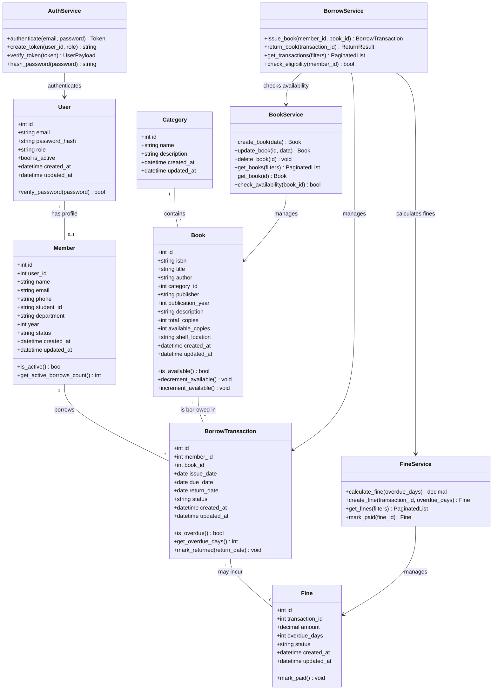
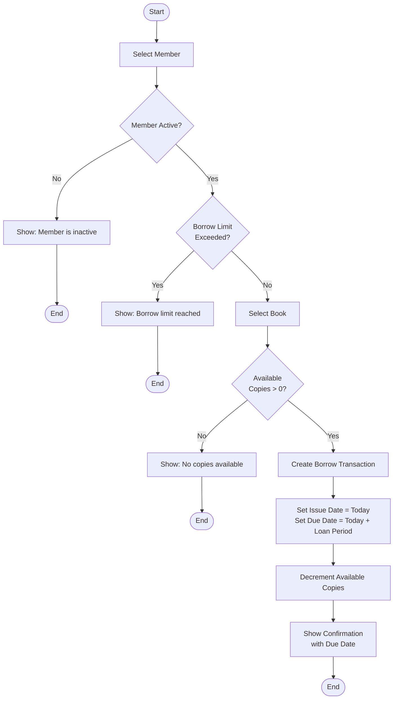
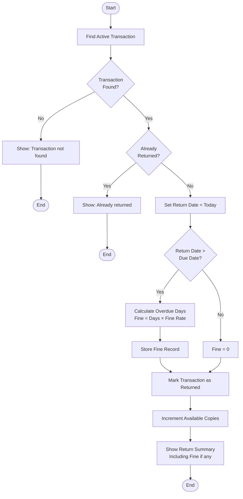
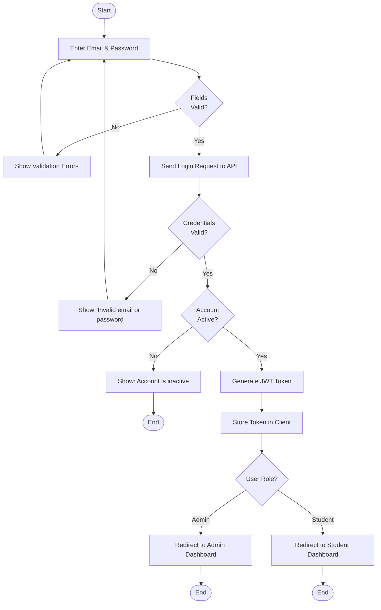
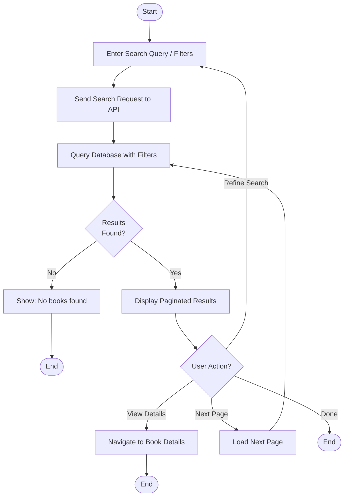
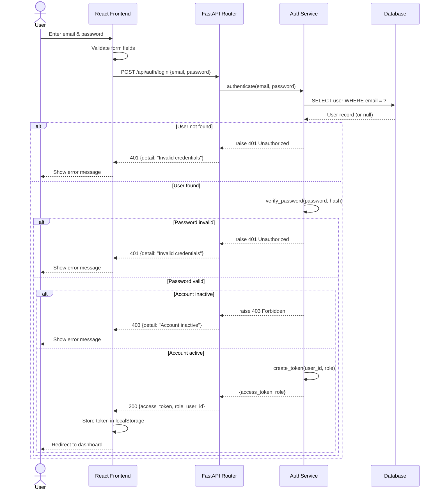
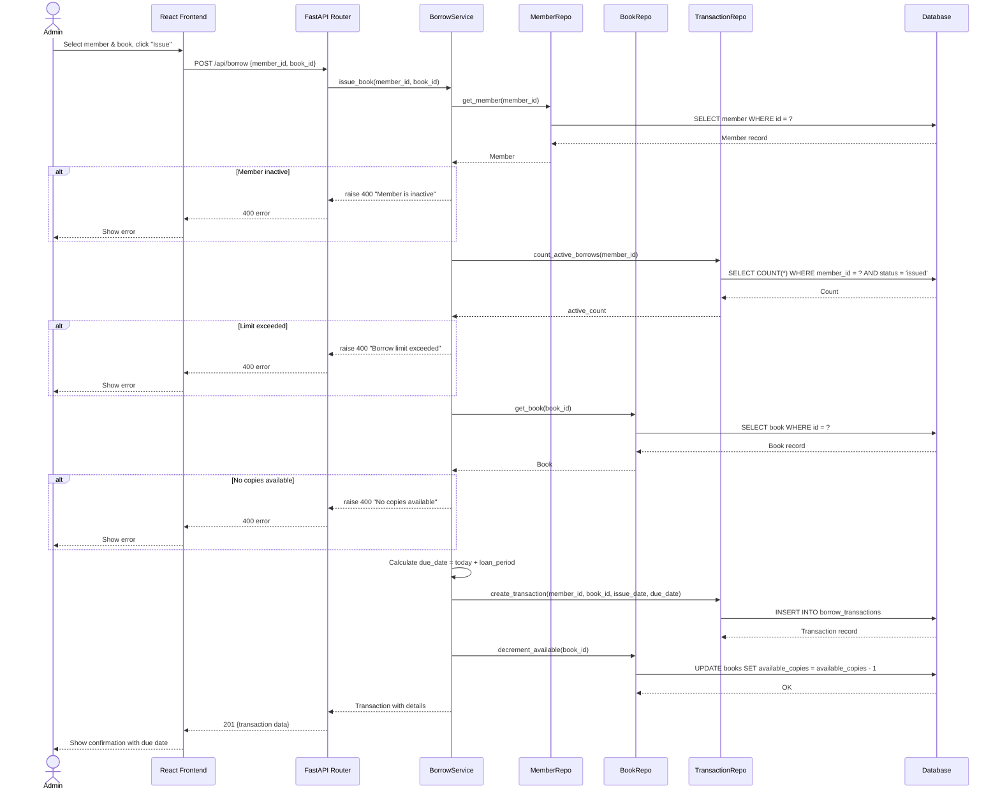
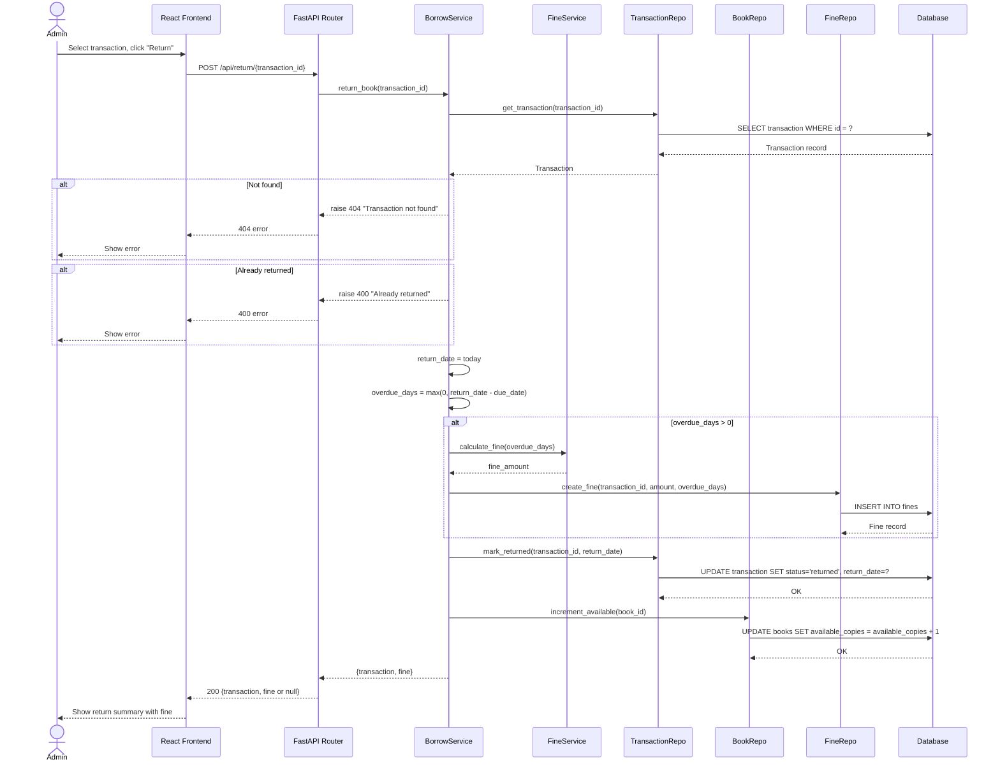
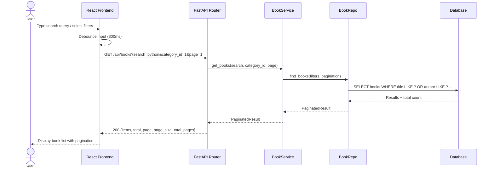
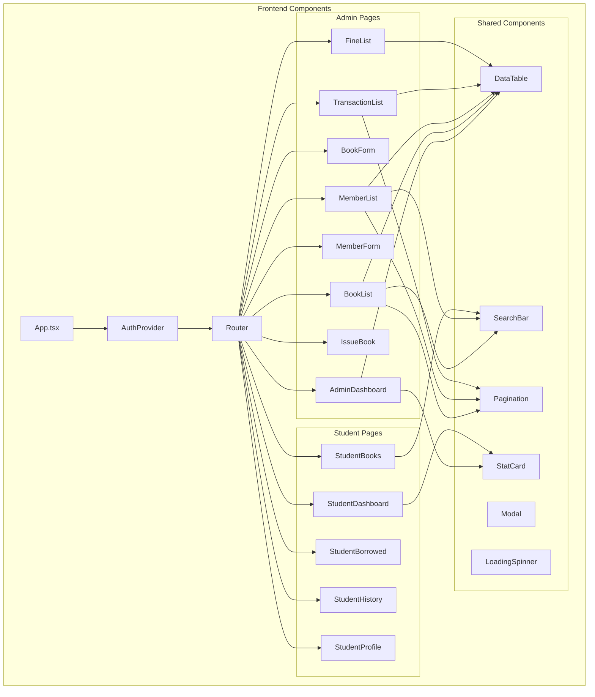

# UML Diagrams — Library Management System

This document contains all UML diagrams using Mermaid syntax for reproducibility.

---

## 1. Class Diagram

---

## 2. Activity Diagram — Issue Book

---

## 3. Activity Diagram — Return Book

---

## 4. Activity Diagram — Login

---

## 5. Activity Diagram — Search Book

---

## 6. Sequence Diagram — Login

---

## 7. Sequence Diagram — Issue Book

---

## 8. Sequence Diagram — Return Book

---

## 9. Sequence Diagram — Search Books

---

## 10. Component Diagram

