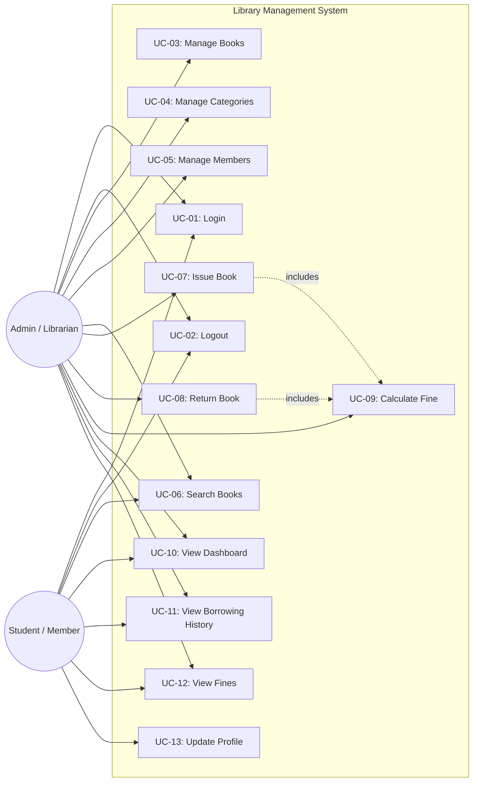

# Use Cases — Library Management System

## Actors

| Actor | Description |
|-------|-------------|
| **Admin / Librarian** | Library staff who manages books, members, and borrowing operations. |
| **Student / Member** | A registered library member who borrows and searches for books. |

---

## Use Case Diagram (Mermaid)

---

## Use Case Descriptions

### UC-01: Login

| Field | Description |
|-------|-------------|
| **Use Case ID** | UC-01 |
| **Name** | Login |
| **Actors** | Admin, Student |
| **Description** | User authenticates with email and password to access the system. |
| **Preconditions** | User has a registered account. |
| **Main Flow** | 1. User opens login page. 2. User enters email and password. 3. System validates credentials. 4. System issues JWT token. 5. User is redirected to their role-specific dashboard. |
| **Alternative Flows** | Invalid credentials → Error message. Inactive account → Error message. |
| **Postconditions** | User is authenticated and has access to role-appropriate features. |
| **Related Requirements** | FR-01 |

---

### UC-02: Logout

| Field | Description |
|-------|-------------|
| **Use Case ID** | UC-02 |
| **Name** | Logout |
| **Actors** | Admin, Student |
| **Description** | User logs out and their session is terminated. |
| **Preconditions** | User is logged in. |
| **Main Flow** | 1. User clicks logout. 2. Token is cleared. 3. Redirect to login. |
| **Postconditions** | User is logged out. |
| **Related Requirements** | FR-02 |

---

### UC-03: Manage Books

| Field | Description |
|-------|-------------|
| **Use Case ID** | UC-03 |
| **Name** | Manage Books |
| **Actors** | Admin |
| **Description** | Admin performs CRUD operations on books (add, view, edit, delete). |
| **Preconditions** | Admin is authenticated. |
| **Main Flow** | Admin can: (a) Add a new book with all details. (b) View book list with search/filter. (c) Edit book details. (d) Delete a book (if no active borrows). |
| **Postconditions** | Book catalog is updated. |
| **Related Requirements** | FR-03, FR-04, FR-05, FR-06 |

---

### UC-04: Manage Categories

| Field | Description |
|-------|-------------|
| **Use Case ID** | UC-04 |
| **Name** | Manage Categories |
| **Actors** | Admin |
| **Description** | Admin creates, edits, and deletes book categories. |
| **Preconditions** | Admin is authenticated. |
| **Main Flow** | Admin can add/edit/delete categories used for classifying books. |
| **Postconditions** | Category list is updated. |
| **Related Requirements** | FR-13 |

---

### UC-05: Manage Members

| Field | Description |
|-------|-------------|
| **Use Case ID** | UC-05 |
| **Name** | Manage Members |
| **Actors** | Admin |
| **Description** | Admin registers, edits, deactivates, and searches for library members. |
| **Preconditions** | Admin is authenticated. |
| **Main Flow** | Admin can: (a) Register a new member. (b) Edit member details. (c) Deactivate a member. (d) Search members. (e) View a member's borrowing history. |
| **Postconditions** | Member records are updated. |
| **Related Requirements** | FR-07 |

---

### UC-06: Search Books

| Field | Description |
|-------|-------------|
| **Use Case ID** | UC-06 |
| **Name** | Search Books |
| **Actors** | Admin, Student |
| **Description** | User searches the book catalog by title, author, ISBN, or category. |
| **Preconditions** | User is authenticated. |
| **Main Flow** | 1. User enters search query. 2. System returns matching books. 3. User can apply filters (category, availability). |
| **Postconditions** | Search results are displayed. |
| **Related Requirements** | FR-06 |

---

### UC-07: Issue Book

| Field | Description |
|-------|-------------|
| **Use Case ID** | UC-07 |
| **Name** | Issue Book |
| **Actors** | Admin |
| **Description** | Admin issues a book to a member after checking eligibility and availability. |
| **Preconditions** | Admin authenticated. Member is active. Book has available copies. Member has not exceeded borrow limit. |
| **Main Flow** | 1. Select member. 2. Select book. 3. System validates eligibility and availability. 4. System creates borrow transaction. 5. System decrements available copies. 6. System calculates and displays due date. |
| **Alternative Flows** | Member inactive → Error. No copies → Error. Limit exceeded → Error. |
| **Postconditions** | Borrow transaction created. Inventory updated. |
| **Related Requirements** | FR-08 |

---

### UC-08: Return Book

| Field | Description |
|-------|-------------|
| **Use Case ID** | UC-08 |
| **Name** | Return Book |
| **Actors** | Admin |
| **Description** | Admin processes a book return, calculating fines for overdue books. |
| **Preconditions** | Admin authenticated. Active borrow transaction exists. |
| **Main Flow** | 1. Find active transaction. 2. Confirm return. 3. System records return date. 4. System calculates overdue days and fine. 5. System marks transaction returned. 6. System increments available copies. |
| **Postconditions** | Transaction marked returned. Inventory updated. Fine recorded if overdue. |
| **Related Requirements** | FR-09, FR-10 |

---

### UC-09: Calculate Fine

| Field | Description |
|-------|-------------|
| **Use Case ID** | UC-09 |
| **Name** | Calculate Fine |
| **Actors** | System (automatic, invoked by UC-08) |
| **Description** | System calculates fine based on overdue days and configurable rate. |
| **Preconditions** | A return is being processed. |
| **Main Flow** | 1. Calculate overdue days. 2. Multiply by fine per day rate. 3. Store fine record. |
| **Postconditions** | Fine is recorded. |
| **Related Requirements** | FR-10 |

---

### UC-10: View Dashboard

| Field | Description |
|-------|-------------|
| **Use Case ID** | UC-10 |
| **Name** | View Dashboard |
| **Actors** | Admin, Student |
| **Description** | Users see role-specific dashboard with statistics and summaries. |
| **Preconditions** | User is authenticated. |
| **Main Flow** | Admin: Library-wide stats + charts. Student: Personal borrowing summary. |
| **Postconditions** | Dashboard is displayed. |
| **Related Requirements** | FR-12 |

---

### UC-11: View Borrowing History

| Field | Description |
|-------|-------------|
| **Use Case ID** | UC-11 |
| **Name** | View Borrowing History |
| **Actors** | Admin, Student |
| **Description** | Users view borrowing transaction history. Admin sees all; student sees own. |
| **Preconditions** | User is authenticated. |
| **Main Flow** | System retrieves and displays transactions with details. |
| **Postconditions** | History is displayed. |
| **Related Requirements** | FR-11 |

---

### UC-12: View Fines

| Field | Description |
|-------|-------------|
| **Use Case ID** | UC-12 |
| **Name** | View Fines |
| **Actors** | Admin, Student |
| **Description** | Users view fine records. Admin sees all; student sees own. |
| **Preconditions** | User is authenticated. |
| **Main Flow** | System retrieves and displays fine records with details. |
| **Postconditions** | Fine records displayed. |
| **Related Requirements** | FR-15 |

---

### UC-13: Update Profile

| Field | Description |
|-------|-------------|
| **Use Case ID** | UC-13 |
| **Name** | Update Profile |
| **Actors** | Student |
| **Description** | Student updates their own profile information. |
| **Preconditions** | Student is authenticated. |
| **Main Flow** | 1. Student navigates to profile. 2. Edits allowed fields. 3. Submits. 4. System validates and saves. |
| **Postconditions** | Profile is updated. |
| **Related Requirements** | FR-14 |
